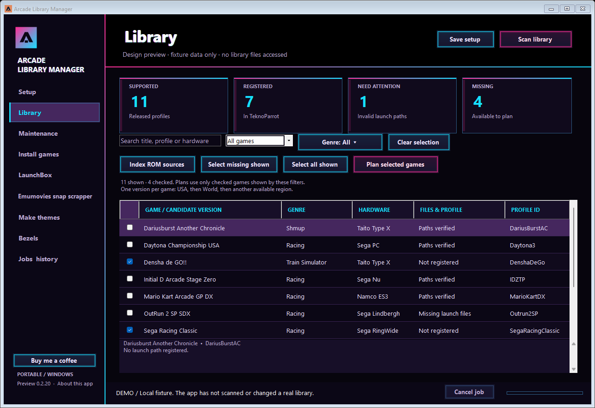

# Arcade Library Manager

A portable Windows app for maintaining a TeknoParrot library, reviewing LaunchBox changes, generating theme videos from local assets, and setting up supported bezels.



*Library view with sample data.*

**Version 0.2.20 is a working preview.** Newly generated themes and previews default to 30 seconds, adjustable from 25 to 33 seconds. Short gameplay snaps loop to fill the selected duration; reference presets follow the same limits. It runs real operations against folders you choose. It opens on Setup and waits for your actions; it does not update or scan libraries automatically at startup. See [implemented scope and limitations](docs/IMPLEMENTATION.md) for the exact feature coverage.

## Download

Download the Windows x64 portable ZIP from [GitHub Releases](https://github.com/ArcadeAdam/arcade-library-manager/releases). Extract the entire ZIP before running the app. The self-contained build includes the .NET runtime; game files, emulator installations, media subscriptions and FFmpeg remain separate.
## Start here

1. Extract the entire Windows x64 release into a writable folder. Keep its files and `assets` folder together.
2. Run `ArcadeLibraryManager.exe`. The self-contained release includes the .NET runtime; no separate .NET installation is needed.
3. In **Setup**, select your existing TeknoParrot installation, ROM source folders, new-game destination, and optional LaunchBox installation. Use one existing ROM source per line; include Downloads if useful.
4. Set the exact name of your existing LaunchBox platform. The default is `TeknoParrot`.
5. Choose an HTTPS Archive.org item/collection URL and an optional separate download cache. Save setup.

The app does not include game files, TeknoParrot, LaunchBox, provider subscriptions, or saved account/card identifiers. Your existing installations and files remain yours.

## Check LaunchBox launch setup

**Setup → Check launch setup** inspects the TeknoParrot emulator, effective platform command, and filename options. Saving setup and discovering related locations also run this read-only check. A working `--profile=` command is accepted when LaunchBox appends the full XML path without a separating space. Explicit `%romfile%` configurations and supported filename-token forms are checked with their corresponding options; the check does not require one spelling for every installation.

If a repair is needed, **Review launch repair** shows each current and proposed value. Close LaunchBox and Big Box, then choose **Back up and apply repair**. The app rechecks the inspected files and folders, backs up existing `Emulators.xml` under `LaunchBox/Backups/ArcadeLibraryManager`, and preserves unrelated emulator entries and scripts. A missing entry can be created from the selected TeknoParrot installation. Ambiguous emulator entries remain for review. Working configurations are left intact.

After repairing or updating the app, rebuild **LaunchBox → Preview sync** to replace an older NeedsReview result. `%ROMNAME%` is not a LaunchBox variable; see the [official command-line variable reference](https://feedback.launchbox-app.com/en/help/articles/7078334-launchbox-built-in-command-line-variables).

## Run a maintenance batch

Use **Setup → Discover related locations** after selecting your main folder. Review the suggested emulator, LaunchBox, theme, MAME artwork, and tool locations; only empty settings are filled. Discovery checks selected folders and known nearby locations without walking entire drives.

Select candidate profiles in **Library**, then open **Maintenance**. The review keeps one available version of each game, preferring **USA → World → other regions**. Choose the work you want: install/repair files, synchronize LaunchBox, generate missing themes, and set up bezels. **Review maintenance** shows the candidates, selected version, planned stages, and requirements. Alternate versions remain visible and unchecked. **Run selected plan** runs the checked games and saves a journal and readable report.

Stages retain their results independently. A missing dependency or unavailable source is reported for that game, while independent work continues. **Resume unfinished** prepares a fresh review using current files and retries unfinished stages without repeating successful stages. A settings change requires a new explicit review.

Use Emumovies snap scrapper for gameplay videos and LaunchBox for artwork before creating themes here. Older batches retain their history, but retired artwork/provider stages cannot execute. A settings change requires a new reviewed selection.

## Install and update games

- **Scan library** reads released TeknoParrot profiles and checks registered launch paths. Developer-only profiles are excluded. Path checks are not play-testing.
- **Library → Index ROM sources** searches the chosen folders and saves a reusable file index. The first scan of a large library can take time; cancellation is available. Run it again after changing your sources.
- Choose candidate profiles, or **Select missing**, then **Plan selected games**. All scanned profiles remain visible, but the plan keeps one available version per game: USA first, then World, then another region. If a ready installation already exists, it is retained instead of adding another regional profile. The plan explains reuse, extraction, download, excluded alternatives, or why an item needs review. Double-click a row for exact paths and sources.
- In **Install games**, review the checkboxes and choose **Run selected plan**. Only selected items run. Downloads and local archives are checked before registration, and new profiles are created from the current templates.
- For emulator updates, use **Install games → Official emulator updates → Check components**. Review the component list, close TeknoParrot and running games, and apply the selected updates.

Existing profiles retain their controls and unrelated settings. Path repair starts from the existing profile and makes a backup. New profiles use the template's defaults; configure and test controls yourself.

The first source adapter supports **Archive.org ZIP packages with exact catalog mappings**. It does not guess an edition from a similar title. Files without a verified recipe, unavailable downloads, or missing dependencies remain for review. RAR/7z extraction and arbitrary download sites are not implemented in this release, even though these files may appear in the local inventory.

## Install games by genre

In **Library**, choose **Genre → Racing**, then **Select missing shown → Plan selected games**. The genre menu uses your TeknoParrot metadata and groups Racing, Racer, and Driving together. It also offers **All genres** and **Unspecified** for games without a genre. You can combine the genre with the status selector and title/profile/hardware search.

Installation and maintenance reviews use only the checked games shown by the current Library filters; checked games hidden by a filter are excluded. **Select missing shown** and **Select all shown** replace the previous selection, while **Clear selection** clears every checkmark. The normal USA, World, then other version preference remains in effect. Maintenance's explicit **Use all candidate profiles** clears the filters before selecting the whole catalog.

## Shared ROM dependencies and retries

Some classic arcade games require separate parent, BIOS or device ZIPs in addition to their game download. Keep those ZIPs in a configured ROM source, then use **Index ROM sources**. Missing-content errors list the required ZIP sets. The app validates CRC, size and content SHA1 before registration and copies required local companion ZIPs beside the installed game. The configured TeknoParrot collection does not necessarily supply these separate dependencies; they are not bundled with this app.

An empty archive/source and a 0-byte download mean the recipe has no verified download mapping; that plan has not downloaded the game. Complete local game/parent/device ZIPs can still be indexed and installed. Version 0.2.16 adds the verified Over Rev Model 2B Rev B archive and checks its default revision programs plus the shared Sega billboard device.

After adding missing dependencies, use **Scan library**, **Index ROM sources**, and a fresh **Plan selected games**. Completed downloads and app-owned staging remain reusable. A CHD reused from staging retains the correct final path when the staging folder is committed. Existing destination folders without an app completion marker are flagged for review and preserved; exact matching local files can still be reused.

## Add games to LaunchBox

Use **LaunchBox → Preview sync**, inspect the proposed additions, updates, loader combinations, and duplicate consolidations, then **Apply selected changes**. Close LaunchBox and Big Box before committing.

Synchronization targets the existing platform and matches TeknoParrot profile identities, including existing alternate applications. Kept games retain their IDs, favorites, play history, curated fields, and launch hooks; the backup preserves removed duplicate records. Only one ready version of each game is eligible for synchronization: USA first, then World, then another region. Other locales and recognized revision variants are skipped. When exactly one existing game represents the family, it is updated in place as appropriate instead of adding another entry; its ID and history are retained. Verified ELF and ELFLoader2 loader pairs are combined into one LaunchBox game: ELFLoader2 becomes the default, and the older loader is retained as an additional application. The region preference is applied first; ELFLoader2 wins among otherwise equivalent ready candidates. Existing regional/version duplicate families, including multiple Total Vice locales, receive a reviewed **Consolidate** action that keeps the preferred LaunchBox entry and backs up the removed records. Verified playlist references are redirected to the kept game, preserving playlist membership. Ambiguous identities, conflicting hooks, or unsupported references stay for review. Game files and TeknoParrot profiles are retained.

A backup and rollback journal cover the platform and any affected playlists. **Undo last sync** restores the transaction only if its files still match that operation; concurrent user edits are preserved.

## Emumovies snap scrapper

Open **Emumovies snap scrapper**, directly above **Make themes**. Select a LaunchBox platform, its EmuMovies catalog, and the ROM matching folder. For TeknoParrot, use `UserProfiles` and `ArcadePC`; the classic arcade fallback selects the appropriate MAME or Sega Model 2 catalog from profile hardware and local identities.

Use **Download EmuMovies Sync** to open the official download page, install Sync, then select its executable in this page. Use **Open Sync / login** to sign in to separately installed [official EmuMovies Sync 2.71](https://emumovies.com/files/file/321-emumovies-sync/). Leave Sync open and signed in for **Download & import missing videos**. **Preview import** and **Import downloaded videos** work with Sync closed. For TeknoParrot, the suggested matching folder is the configured emulator installation's `UserProfiles` folder; saved folder choices are retained. **Download & import missing videos** runs video-only Sync jobs, retains reusable downloads, and fills gaps in the platform's configured LaunchBox video folder. Sync may stage videos already present in LaunchBox; import preserves existing files. No JPG, PNG, or other artwork is selected or imported. LaunchBox can stay open during this file-only import.

**Preview import** checks staged files without downloading or copying library media. **Import downloaded videos** reruns only the import. **Open reports** shows per-run selections, copied/skipped files, and missing matches. Choices are saved separately for each platform. TeknoParrot profiles not yet imported into LaunchBox are included; other platforms use known LaunchBox game identities. Match-folder files are represented by empty filename placeholders, without copying ROM contents.

Keep Sync and this app open during a download. **Cancel job** cancels the owned Sync job and retains staged files. Nothing downloads automatically at startup. Catalog coverage and Sync matching determine which videos are available; a completed run can still report missing games. This workflow supplies EmuMovies videos without changing LaunchBox's internal search implementation.
## Local bezel repositories

Open **Bezels** and choose **Local bezel repository → Browse…**. You can point to a downloaded collection, an extracted repository, or a local network folder. The existing downloaded-bezel setting is retained. **Preview bezels** saves the folder and searches its subfolders after checking your configured MAME artwork folder.

Files must match the TeknoParrot XML profile name exactly: `profile.png`, `profile.zip`, or `profile/bezel.png`. For example, `collections/arcade/aircomb.png` can match `aircomb.xml`. Multiple matches are shown for review. Supported transparent PNGs and single-overlay ZIP packs retain the existing validation, install preview, enable and undo behavior. Source artwork stays unchanged.

## Make themes

1. Open **Make themes → Games** and **Scan local media**. The scan also checks existing `LaunchBox\Videos\Arcade\Theme` and `LaunchBox\Videos\Sega Model 2\Theme` videos, respecting LaunchBox folder overrides.
2. Highlight a game, choose **Render preview**, then **Open preview**.
3. Adjust the composition, movement, and output format in **Theme settings** if needed. Duration defaults to 30 seconds, adjustable from 25 to 33; short snaps loop.
4. Choose **Select missing themes**, then **Generate selected themes**. Rows marked **Reuse Arcade** or **Reuse Sega Model 2** copy the matched video into the configured TeknoParrot theme folder, named for its LaunchBox game. Source videos and existing TeknoParrot themes stay unchanged. Reuse requires no snap, artwork, or FFmpeg; the original format and duration are retained.

Reuse matches classic hardware profiles through exact ROM identities, unique shared LaunchBox database IDs, or conservative names. Arcade and Model 2 stay separate, and conflicting versions or ambiguous matches are left for review. The Model 2 folder also works without an installed LaunchBox platform XML. Scanning does not copy files. Games without a reusable theme still need a gameplay snap before rendering; use Emumovies snap scrapper and LaunchBox for missing local media.

During generation, the table shows only games in the current batch, with each game's status and elapsed time. The top shows overall batch progress, elapsed time, and an estimated remaining time once a completed theme provides a timing sample. The bottom bar continues to show the current task. **Pause batch** finishes the current theme, then holds the queue; **Resume batch** continues from there. Processing time and the remaining-time estimate freeze while paused. **Cancel job** also works while paused. Completed or cancelled batch results stay visible; return to all games to choose another batch. Existing themes remain preserved.

**Fanart** places a smaller, native-aspect gameplay window on the left or right. Its bright border changes color and carries a moving highlight. Transparent foreground art bounces and tilts independently, with a separate logo layer. Wide fanart has a small bounded drift; portrait flyers become a soft color backdrop instead of oversized cropped faces. **Cinema** uses a larger gameplay window. Movement is adjustable from 0 to 100. Every newly rendered theme requires a local gameplay snap; games without a reusable theme or a snap are skipped.

Under **Fanart layers**, choose **Download cutout models** once (about 340 MiB for general and illustrated-character models). Source artwork is processed locally on the CPU; no account is needed. The download is separate from rendering, uses pinned SHA-256 checks, and is not included in the portable ZIP. Generated cutouts are cached. The app rejects empty or nearly rectangular background masks. Text or logos printed across a character can remain in an otherwise usable cutout; inspect a preview before starting a batch.

For curated layers, set **Theme assets folder**, or use its default `LaunchBox\Images\<platform>\Theme Assets`. Inside a folder named for a TeknoParrot profile ID or LaunchBox game GUID, add `background.png`/`.jpg`, `cutout-01.png`, `cutout-02.png`, and optionally `logo.png`. The first two valid transparent foreground files animate independently. Imported cutouts work without either model. Source files are preserved.

Make themes lists one preferred existing LaunchBox game rather than every alternate profile. **Select missing themes** and **Generate selected themes** preserve existing videos. **Render preview** can test the new look even when a theme already exists; it writes to the cache. References guide format and duration, not arbitrary editing or a learned composition. See [cutout models and licenses](docs/CUTOUT-MODELS.md).

Rendering uses the available GPU video encoder automatically (NVIDIA, Intel, or AMD), with CPU fallback if hardware encoding cannot initialize. Static artwork is resized and blurred once per render and reused before the animation effects. CPU decoding, composition, and software encoding use bounded parallel threads; there is no Quiet mode. The selected encoder and render time are recorded beside each generated theme. The scene composition still uses CPU filters.

**FFmpeg and ffprobe are not bundled.** Select a complete FFmpeg build in Setup. The app can use LaunchBox's `ThirdParty\FFMPEG` folder when it contains both tools, or a separate installation that LaunchBox updates will not replace. Keep `ffprobe.exe` beside `ffmpeg.exe`. Selecting their containing folder or the extracted build folder is also supported. The app checks the pair before starting a batch that needs rendering and names the missing executable if either is absent. The renderer needs a build with the required H.264/audio encoders and filters. Redistribution obligations depend on the exact FFmpeg build; provide it separately and follow that build's license.

## Bezels

Set a **MAME artwork folder** and/or **Downloaded bezel packs** folder in Setup. In **Bezels**, use **Preview bezels**, inspect each change, and choose **Install & enable selected**.

**Open online source** opens your configured repository or Discord channel. Download packs through your own account and put them in the import folder; this release does not automatically scrape Discord or download private attachments.

Supported inputs are exact profile-ID matches such as `profileId.png`, `profileId.zip`, or a `profileId` subfolder with a suitable PNG. Artwork must be a usable transparent overlay. A ZIP with multiple layers, complex MAME layouts, or ambiguous matches is left for review. The TeknoParrot template must document a supported bezel setting and destination; unknown layouts are not guessed.

The preview describes any fullscreen/no-stretch changes. Existing controls are retained. Close TeknoParrot and its games before applying. **Undo bezel change** uses the saved journal to restore unchanged app-managed files. Check the final visual fit in the game.

## Jobs, backups, and drive readiness

Keep the app open while a batch runs. **Cancel job** requests a safe stop. **Jobs → Resume unfinished** restores individual game-install items; **Maintenance → Resume unfinished** restores complete maintenance batches to review after interruption. It does not launch a background service when the app closes. Individual media and synchronization actions can also be rerun; existing results are preserved or skipped as applicable.

Before guarded writes, the app queries Windows filesystem readiness. If a destination NTFS volume is marked dirty, is read-only, or cannot be assessed, the affected write operation is paused. This applies to configured volumes generally, not a particular drive letter. The app does not clear the flag, repair a disk, dismount it, or start a surface test. Resolve the reported filesystem issue outside the app before retrying. A clear dirty flag is not a physical-disk health assessment.

Updates, LaunchBox commits, profile repairs, and bezel changes have operation-specific backups. There is no universal one-click uninstall for a completed game installation. Do not delete staging, partial downloads, or backup folders while work is active.

## Settings and sharing

Settings, the inventory, and game-job history live in the app's `data` folder by default. Update backups are stored there; LaunchBox and bezel rollback locations are recorded by their operations. **Jobs → Open app data** and **Export report** help locate results.

Use **Setup → Export preset** to share configuration. Presets and reports can contain local paths and source locations. Share the clean release ZIP with friends rather than your used `data` folder. The video scraper controls official EmuMovies Sync; sign-in and credentials stay in Sync. The app does not store EmuMovies passwords or download artwork.

The original [specification](docs/SPECIFICATION.md) includes future goals. [IMPLEMENTATION.md](docs/IMPLEMENTATION.md) distinguishes those goals from this release's actual behavior.


## Build from source

Use Windows x64, PowerShell 7, and the .NET SDK specified in [global.json](global.json). From the project directory:

```powershell
# Optional if the required SDK is not already installed:
.\scripts\bootstrap.ps1
.\scripts\build.ps1
```

The build runs tests and creates self-contained app and source ZIPs in `artifacts`. See [build instructions](docs/BUILDING.md) for FFmpeg-backed media tests and other options.

## Support development

The **Buy me a coffee** button above the portable/version labels at the bottom left opens [the developer’s PayPal page](https://www.paypal.com/paypalme/acbauer12/9.99) in your browser with 9.99 prefilled. Review the amount and currency on PayPal. Donations are optional.
